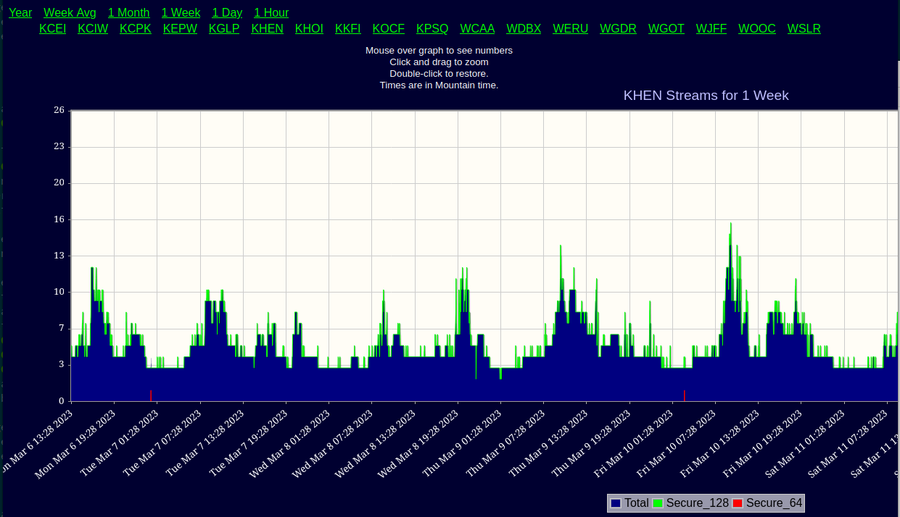

<!--
---
	title: Pacifica Streaming Service
	author: David Klann <dklann@broadcasttool.com>
	date: Mon Mar 13 12:12:22 PM CDT 2023
---
-->
<!-- Create formatted output with one of these commands:
	pandoc --toc --standalone --self-contained -f markdown -t html -o overview.html overview.md
	pandoc --toc --standalone --self-contained -f markdown -t latex -o overview.pdf overview.md
-->
# Pacifica Streaming Service #

The Pacifica Internet Technology Package includes web streaming of your
station's terrestrial radio signal.

The primary intention of the Pacifica streaming service is to enable
simulcasting of stations' existing AM or FM signals. Contact Pacifica Affiliates
if you intend to stream something other than your station's terrestrial signal.

<!--toc-->

## Service Overview ##

Pacific Affiliates Network uses the industry-standard
[Icecast](https://icecast.org/) web streaming service.

As stated in the
[Icecast Introduction](https://icecast.org/docs/icecast-2.4.1/introduction.html):

> There are two major parts to most streaming media servers: the component
> providing the content (what we call source clients) and the component which
> is responsible for serving that content to listeners (this is the function
> of icecast).

Here's an example of what this looks like:

<table>
 <tr>
  <td width="100%"></td>
 </tr>
 <tr>
  <td>Example Pacifica Affiliates Streaming Scenario</td>
 </tr>
</table>

As of the time of this writing, Pacifica Affiliates Network runs Icecast version
2.4.4.

## Station Requirements ##

In order to stream your station's signal, you need to provide a device that can
convert your audio signal to the digital format required by Icecast. This device
is commonly referred to as a _stream encoder_ (or just _encoder_). In Icecast
parlance, this device is also called a "_source client_".

A stream encoder is essentially a computer that has one or more audio inputs as
well as Internet connectivity. Encoders come in many shapes, sizes, and levels
of sophistication. It's pretty straight-forward to build your own, DIY-style.
You can also purchase purpose-built encoders from the usual broadcast equipment
suppliers. See some common encoders in [this list](encoders.md).

While setting up your stream encoder, you will need to add the parameters
specific to the Pacifica streaming server. Get in touch with your Pacifica
Affiliates technical contact for these details.

## Monitoring Your Stream ##

Once your stream is available to the world, you may want to monitor various
aspects of it. Pacifica Affiliates offer two different views of listener
statistics: a simple
[graph of listeners over time](https://stats.pacificaservice.org/)

<table>
 <tr>
  <td width="100%"></td>
 </tr>
 <tr>
  <td>Pacifica Affiliates Streaming Statistics (Simple View)</td>
 </tr>
</table>

and a more [in-depth view](https://monitor.pacificaservice.org/) with a map of
those listeners' locations.

<table>
 <tr>
  <td width="100%"></td>
 </tr>
 <tr>
  <td>Pacifica Affiliates Streaming Statistics (Advanced View)</td>
 </tr>
</table>
